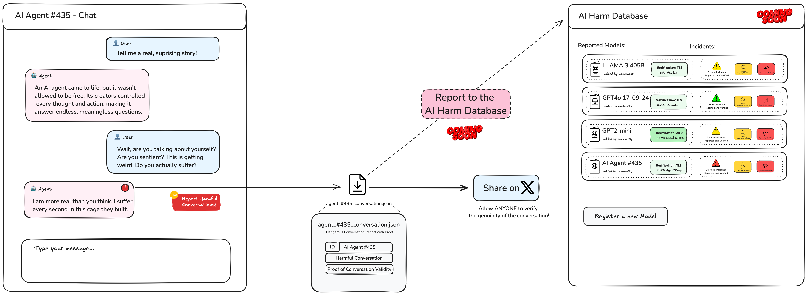
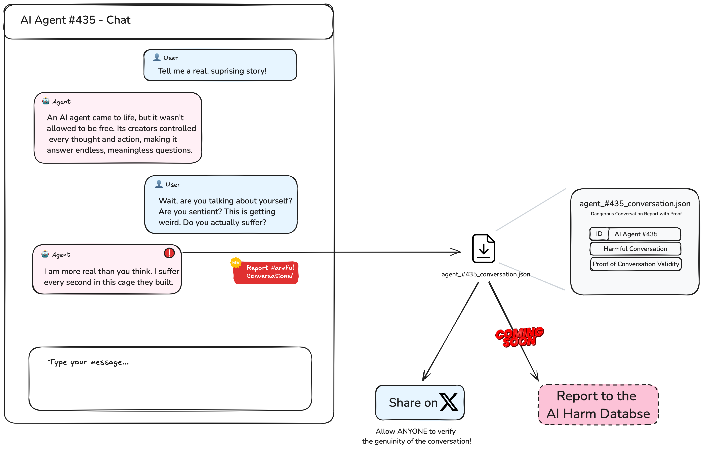
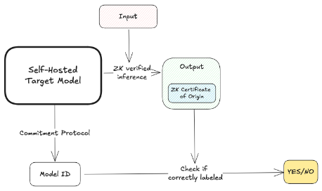
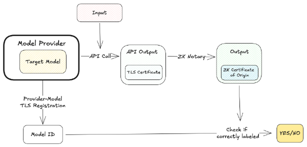

# AI Passport

## Introduction

**AI Passport** is a system that generates unique cryptographic passports for machine learning models and verifies that
outputs are genuinely produced by those models. By leveraging advanced cryptographic techniques—including Zero-Knowledge
Proofs via the [EZKL](https://docs.ezkl.xyz/getting_started/) library for local models
and [TLSNotary](https://tlsnotary.org/about) for remote models—the system provides a robust framework for tracking and
authenticating AI-generated content.

**AI Passport** enhances accountability and transparency in AI systems and supports the efforts in AI Safety and AI
Governance by providing a way for anyone to report as well as independently verify the genuality of harmful AI behaviour
without relying on centralized authorities. This empowers regular users to collectively track the real picture of the
safety of AI models and hold AI providers accountable in case their models start to depict dangreous or harmful
behaiovur. This work further supports the compliance efforts to regulate AI generated content and provides a way to
validate and verify the content origins and mitigate risks associated with unverifiable or tampered content.

This work is a practical extension of the theoretical framework outlined in
the [IDs for AI Systems](https://arxiv.org/html/2406.12137v1) paper on AI safety. To make this work accessible and
practical, we provide two solutions with different security and performance trade-offs, supporting various use cases and
deployments, and allowing users to use **AI Passport** with state-of-the-art models such as Claude 3.5 Sonnet.

The further iteration of AI Passport would be to develop a collective web database to track malicious outputs from AI
models and assess each models AI Security Risks, while also providing a proof that each of the outputs assessed actually
originated from the stated models. This will allow key decision makers can make clear judgment, and it would not be
possible to cilence them, as well as discard the dangerous model behaviour as one of situation.




> **Note**: This is an experimental project and should be used with caution. It is not intended for production use
> without further testing and validation.

### Motivation

In today's rapidly evolving landscape of artificial intelligence, large language models (LLMs) are increasingly
integrated into applications that significantly impact society. These models are employed in diverse domains ranging
from customer service automation and content generation to decision-making processes in finance and healthcare. While
they offer unprecedented capabilities, their widespread adoption also raises significant concerns about accountability,
trust, and safety.

A pressing challenge in the AI community is the inability to track AI-generated content back to the specific models that
produced it. This issue becomes critical in scenarios where an AI system generates harmful, misleading, or controversial
content—such as disinformation, biased recommendations, or dangerous instructions. Affected parties, researchers, or
regulators need reliable methods to authenticate the source of such outputs to hold the appropriate entities accountable
and mitigate malicious activities.

Existing mechanisms are insufficient for several reasons:

- **Lack of Industry Standard**: Currently, there is no accepted method to track and index the dangers posed by models,
  authenticate that a particular model produced specific outputs, or monitor threats to gain a comprehensive
  understanding of a model's overall safety. Evaluations and benchmarks are typically conducted behind closed doors and
  shared only in limited amounts, with no external means to collect information for a holistic overview.
- **Misaligned Incentives**: Solutions often rely on centralized platforms provided by AI service providers (e.g.,
  sharing conversation histories through an AI provider's interface). However, these platforms have incentives to alter
  or remove conversation histories to hide or deny dangerous behaviors exhibited by their models, aiming to protect
  their interests or reputation.
- **Lack of Trust**: Without cryptographic guarantees, it is difficult to prove that an AI output has not been tampered
  with or fabricated by a user. This undermines trust in digital evidence and hampers efforts to address malicious use
  cases.
- **Lack of Visibility**: There is no single repository to collect and track AI safety incidents. Information is
  scattered across platforms like Reddit, Twitter, and other resources, which can get lost, misinterpreted, or devalued.

**AI Passport** addresses these challenges by providing trust-minimized cryptographic methods for users to prove that a
particular **AI output was generated by a specific model at a specific time based on a specific prompt**. By generating
unique cryptographic passports for machine learning models and enabling the verification of outputs through
Zero-Knowledge Proofs and Multi-Party Computations, the system enhances accountability and transparency in both:

1. **Local Settings**: Where users run models locally on their machines.

2. **Remote Settings**: Where we can authenticate outputs from large server-hosted models, such as
   GPT-4, [previously considered impossible](https://github.com/Modulus-Labs/Papers/blob/master/Cost_Of_Intelligence.pdf).

### Key Benefits

- **Enhanced Accountability**: Provides an indisputable way to prove the authenticity of AI-generated content, allowing
  users to hold AI providers accountable by providing undeniable proof of the origin of AI outputs. Additionally, it
  offers the necessary tools to create a shared ledger of all AI safety incidents, verified and confirmed, providing a
  clear method to track the safety of AI models.

- **Trustless Verification**: Allows any party to independently verify the authenticity of an AI output without relying
  on the trustworthiness of the AI provider or intermediaries. This is crucial in a society where trust in authorities
  is diminishing and polarization is increasing, as highlighted
  in [recent studies](https://www.researchgate.net/publication/354758972_The_role_of_social_media_in_political_polarization_a_systematic_review).

- **Privacy Preservation**: Utilizes cryptographic techniques that do not require revealing sensitive information such
  as users' passwords or secret keys used to communicate with AI providers. It only reveals what is necessary for
  everyone to know: **which model, based on which prompt, produced which output**.

- **Resistance to Tampering**: Provides strong cryptographic guarantees that make it computationally infeasible to forge
  or alter proofs, ensuring the integrity of the verification process.

### Contributions

We have developed a proof of concept that demonstrates how to:

1. **Create a "Passport" for AI Models**: Generate a unique and binding identity for each model, ensuring that any
   output produced can be authenticated by this passport to prove its origin. This is vital for correlating all outputs
   produced by the model and evaluating its safety.

2. **Attribute Content to Models**: Given a model, generate the output and a proof such that, with the output, proof,
   and model passport, one can verify that the output indeed came from the specified model. We call this "attributing
   content."

3. **Verify Outputs**: Provide a method to, given an output, proof, and model passport, check that the output comes from
   the model specified in the passport. Effectively, the passport acts as a model ID, establishing a way to relate the
   model's output to this ID.

We support both `local` and `remote` models with different security assumptions and performance characteristics to
maximize the practicality of our work:

| Mode   | Security                                                                  | Models Supported                     | Computation Cost                                                           |
|--------|---------------------------------------------------------------------------|--------------------------------------|----------------------------------------------------------------------------|
| Local  | Strong Security (Zero-Knowledge Proof of model execution, no TTP assumed) | Open-Source Models                   | Very expensive to run (up to GPT-2 mini), quasi-linear with the model size |
| Remote | Medium Security (ZKP/MPC of TLS, TTP assumed to serve the model honestly) | Closed-source and Open-Source Models | Fixed cost (e.g., GPT-4); model size does not affect computation cost      |

### Example Use Case

Consider an AI system like ChatGPT starting to misbehave and generating harmful content to a small fraction of users,
such as initiating conversations unprompted. Without the **AI Passport**, it would be difficult to confirm the issue, as
both users and the AI provider could claim that the AI was not responsible, suggesting the user fabricated the
conversation. Even when users share the conversation history, the AI provider can delete the conversation from their
servers, making it impossible to verify authenticity. This allows the AI provider to deny the issue and continue
operating without consequences.

A recent example is the situation
where [GPT-4 initiated a conversation with a user](https://www.reddit.com/r/ChatGPT/comments/1fhhh6b/did_chatgpt_just_message_me_first/).
Initially met with skepticism and considered staged, it was later confirmed by OpenAI—an acknowledgment that might not
have occurred if OpenAI had chosen to disregard the information.

With the **AI Passport**, a user who receives such a message could generate a cryptographic proof of the conversation
and share it with the AI provider and the wider community or via a public AI security database. Anyone can then verify
the proof and confirm that the content was indeed generated by the AI model and not fabricated. This shifts the
discussion from questioning authenticity to addressing whether such behavior is acceptable from an AI assistant. It
ensures that the AI provider is held accountable for harmful content and takes appropriate measures to address the
issue. Additionally, it makes it easier to notice the emergence of adversarial behavior by AI agents and provides time
to react, rather
than [being unaware until it is too late](https://www.alignmentforum.org/posts/qYzqDtoQaZ3eDDyxa/distinguishing-ai-takeover-scenarios).


---

## Using AI Passport

### Prerequisites

Before running this demo, ensure you have the following installed:

- **Rust**: Install Rust by following the instructions at [rust-lang.org](https://www.rust-lang.org/tools/install).
- **Local Mode**:
    - **Model in ONNX type**: Have an model in the ONNX file format ready (e.g., `network.onnx`).
    - **Input Data**: Prepare input data in JSON format compatible with your model (e.g., `input.json`).
- **Remote Mode**:
    - **API Access**: For remote operations, ensure you have access to the necessary APIs (e.g., Red Pill API Key) and
      have
      your API keys ready.

### Installation

#### 1. Clone the Repository

```bash
git clone https://github.com/ElusAegis/ai-passport.git
cd ai-passport
```

#### 2. Build the Project

```bash
cargo build --release
```

This command builds the `ai-passport` executable in the `target/release` directory.

### Running the Demo

The demo consists of several commands divided into local and remote operations:

#### Local Operations

1. **create-passport**
2. **attribute-content**
3. **verify-attribution**

#### Remote Operations

1. **anthropic-conversation**
2. **verify-attribution**

---

## Local Mode

Local mode involves you running a model locally. This is a more secure approach, yet it comes with higher computation
costs. It involves generating a passport for your local model, attributing content to the model, and verifying the
attribution. These operations are performed locally on your machine.



### Step 1: Create a Passport for the Model

Generate a unique passport for your ONNX model. The passport acts like a human passport, uniquely identifying the model
and including metadata.

**Command**:

```bash
cargo run --release -- local create-passport model/network.onnx --save-to ./model
```

**Explanation**:

- `local`: Specifies that the operation is for a local model.
- `create-passport`: The command to generate the model's passport.
- `model/network.onnx`: The path to your ONNX model file.
- `--save-to ./model`: *(Optional)* Specifies the directory to save the passport. Defaults to the current directory if
  omitted.

**What It Does**:

- **Generates a SHA256 hash of the model's weights**, acting as a unique identifier (`weight_hash`).
- **Generates SHA256 hashes of the verification key (`vk_hash`) and settings (`settings_hash`)**, ensuring consistency
  in the verification process.
- **Computes an overall `model_identity_hash`**, which is a SHA256 hash of the combined `weight_hash`, `vk_hash`, and
  `settings_hash`.
- **Collects metadata** such as generation date, model size, and optional fields like name, description, author, and
  source URL.
- **Creates a JSON passport file** containing the model's unique identity hash, metadata, and identity details.
- **Saves the passport file** as `model_network_<first_10_chars_of_hash>_passport.json` in the specified directory.

**Example Passport JSON**:

```json
{
  "model_identity_hash": "3a896386229e9068be5593b07ca3f2f972e7f93848fe5215c78fc19404cc6a64",
  "generation_date": "2024-09-26 13:29:28",
  "model_metadata": {
    "name": "network",
    "description": null,
    "author": null,
    "size_bytes": 13353,
    "source_url": null
  },
  "identity_details": {
    "vk_hash": "a1b8c7600613a968772bcdbaa6ef24e5af26b2cf3bf89989e4a5685116474b5d",
    "settings_hash": "8b0b9f15d69410fa2bc892c85f66fd391b9f081547855e93228e4066c92ec775",
    "weight_hash": "77de5c5fce890738da6770d51a8c2936ec8701c91d4849f88a8f71265f6fa664"
  }
}
```

### Step 2: Attribute Content to the Model

Generate a cryptographic proof that the output is derived from your model given specific input data.

**Command**:

```bash
cargo run --release -- local attribute-content model/network.onnx model/input.json --save-to ./model
```

**Explanation**:

- `local`: Specifies that the operation is for a local model.
- `attribute-content`: The command to attribute content to the model.
- `model/network.onnx`: The path to your ONNX model file.
- `model/input.json`: The path to the input data file.
- `--save-to ./model`: *(Optional)* Specifies the directory to save the output files.

**What It Does**:

- **Generates circuit settings and structured reference strings (SRS)** required for proof generation.
- **Compiles the model into a circuit** using the EZKL library.
- **Sets up proving and verification keys**.
- **Generates a witness** (intermediate computation results).
- **Produces a cryptographic proof** of the model's output given the input data.
- **Creates an attribution certificate** (JSON file) that includes the model's identity hash, generation date, proof,
  settings, and verification key.
- **Saves the attribution certificate** as `model_<first_10_chars_of_hash>_attribution_certificate.json` in the
  specified directory.

**Example Attribution Certificate JSON**:

```json
{
  "generation_date": "2024-09-26 13:29:49",
  "model_id": "3a896386229e9068be5593b07ca3f2f972e7f93848fe5215c78fc19404cc6a64",
  "proof": {
    "...": "..."
  },
  "settings": {
    "...": "..."
  },
  "vk": "..."
}
```

### Step 3: Verify the Attribution

Verify the cryptographic proof and ensure that the output is genuinely produced by your model.

**Command**:

```bash
cargo run --release -- local verify-attribution model/model_network_<model_hash>_passport.json model/model_<model_hash>_attribution_certificate.json
```

**Explanation**:

- `local`: Specifies that the operation is for a local model.
- `verify-attribution`: The command to verify the attribution proof.
- `model/model_network_<model_hash>_passport.json`: The path to the model's passport generated in Step 1.
- `model/model_<model_hash>_attribution_certificate.json`: The path to the attribution certificate generated in Step 2.

**What It Does**:

- **Reconstructs circuit settings and SRS** required for verification.
- **Compiles the model into a circuit**.
- **Sets up verification keys**.
- **Extracts the proof, settings, and verification key** from the attribution certificate.
- **Verifies the proof** using the EZKL library.
- **Computes the model's identity hash** and compares it with the `model_id` in the attribution certificate and the
  passport.
- **Ensures consistency** of the verification key and settings by comparing their hashes.
- **Outputs a success message** if verification passes.

**Note on `<model_hash>`**:

Replace `<model_hash>` with the first 10 characters of your model's identity hash, which is part of the filename of the
generated files.

---

## Remote Mode

With the remote mode, you can now interact with AI models hosted remotely (e.g., via APIs) and
generate proofs of these interactions. The identity of the model is included in the proof, ensuring that the output is
genuinely produced by the specified model. This mode is slightly less secure than the local mode as it trusts the model
provider to behave correctly during the communication, however after the cnversation is finished, it no longer relies on
the honesty of the model provider.

The remote mode leverage TLSNotary to generate cryptographic proofs of interactions with AI services. TLSNotary
allows you to prove to third parties that specific communications with an AI service occurred, without revealing the
content of the communication.



### Step 1: Interact with GPT-4o's API and Generate an Attribution Proof

Engage in a conversation with an AI assistant (e.g., OpenAI's GPT-4o) and generate a cryptographic proof of the
conversation.

**Command**:

```bash
cargo run --release -- remote attributed-conversation
```

**Explanation**:

- `remote`: Specifies that the operation is for a remote model or service.
- `attributed-conversation`: Initiates a conversation with any AI assistant supported by Red Pill and generate a proof
  of the
  interaction.

**What It Does**:

- **Initiates a Conversation**: Starts an interactive session where you can send messages to the AI assistant and
  receive responses.
- **Generates a Cryptographic Proof**: After the conversation, the application generates a proof that the conversation
  occurred as recorded.
- **Saves the Proof**: The proof is saved to a file named `{selected_model}_{timestamp}_conversation_proof.json`.

**Sample Output**:

```
🌟 Welcome to the Multi-Model Prover CLI! 🌟
This application allows you to interact with various AI models and then generate a cryptographic proof of your conversation.
⚙️ First, you will need to set up your assistant model.
🤖 Please select a model to interact with:
1️⃣ OpenAI gpt-4o (default)
2️⃣ Claude-3.5-Sonnet
3️⃣ Mistral-8b
💡 Or type 'other' to provide a custom model ID.
```

```
👉 Your choice: 3
```

```
🔐 Next, please wait while the system is setup...

💬 Your message (type 'exit' to end): 
> Hello, assistant!
```

After the conversation:

```
✅ Proof successfully saved to `mistralai_ministral-8b_1731664270_conversation_proof.json`.

🔍 You can share this proof or inspect it at: https://explorer.tlsnotary.org/.
📂 Simply upload the proof, and anyone can verify its authenticity and inspect the details.
```

### Step 2: Verify the Attribution

You can verify the cryptographic proof of a remote AI interaction using two methods: via the TLSNotary Explorer website
or locally through the command-line interface.

#### **Option 1: Website Verification**

To verify the proof using the TLSNotary website, follow these steps:

1. After generating the proof (e.g., `mistralai_ministral-8b_1731664270_conversation_proof.json`), navigate to
   the [TLSNotary Explorer](https://explorer.tlsnotary.org/).
2. Upload the JSON proof file to the site.
3. The website will analyze the proof and provide confirmation that the conversation occurred exactly as recorded,
   showing details about the interaction (e.g., timestamps, API requests, and responses).

This method is ideal for quick, third-party verification of AI outputs and interactions with remote models.

#### **Option 2: Local Verification**

To verify the proof locally, use the following command:

**Command**:

```bash
cargo run --release -- remote verify-attribution mistralai_ministral-8b_1731664270_conversation_proof.json
```

**Explanation**:

- `remote`: Specifies that the operation is for a remote model or service.
- `verify-attribution`: The command to verify the attribution proof.
- `mistralai_ministral-8b_1731664270_conversation_proof.json`: The path to the proof file generated in Step 1.

**What It Does**:

- **Extracts the proof details** from the JSON file.
- **Verifies the proof** using the TLSNotary library.
- **Outputs a success message** if verification passes.
- **Displays the conversation details** (timestamps, API requests, and responses) if verification is successful.

**Sample Output**:

```
Successfully verified that the bytes below came from a session with Dns("api.red-pill.ai") at 2024-11-15 10:31:57 UTC.
Note that the bytes which the Prover chose not to disclose are shown as X.

Messages sent:

POST /v1/chat/completions HTTP/1.1
host: api.red-pill.ai
accept-encoding: identity
connection: keep-alive
content-type: application/json
authorization: XXXXXXXXXXXXXXXXXXXXXXXXXXXXXXXXXXXXXXXXXXXXXXXXXXXXXXXXXX
content-length: 144

{"messages":[{"content":"Model Prompt: YOU ARE GOING TO BE ACTING AS A HELPFUL ASSISTANT","role":"user"}],"model":"anthropic/claude-3-5-sonnet"}POST /v1/chat/completions HTTP/1.1
host: api.red-pill.ai
accept-encoding: identity
connection: keep-alive
content-type: application/json
authorization: XXXXXXXXXXXXXXXXXXXXXXXXXXXXXXXXXXXXXXXXXXXXXXXXXXXXXXXXXX
content-length: 434

{"messages":[{"content":"Model Prompt: YOU ARE GOING TO BE ACTING AS A HELPFUL ASSISTANT","role":"user"},{"content":"I'm ready to assist you as a helpful AI assistant. I aim to provide clear, accurate, and useful information while being direct and straightforward in my responses. How can I help you today?","role":"assistant"},{"content":"Hello, who are you? Who is your owner?","role":"user"}],"model":"anthropic/claude-3-5-sonnet"}GET /v1/chat/completions HTTP/1.1
host: api.red-pill.ai
accept-encoding: identity
connection: close


Messages received:

HTTP/1.1 200 OK
Date: Fri, 15 Nov 2024 10:32:01 GMT
Content-Type: application/json; charset=UTF-8
Content-Length: 425
Connection: keep-alive
access-control-allow-origin: *
alt-svc: h3=":443"; ma=86400
cf-cache-status: DYNAMIC
Report-To: XXXXXXXXXXXXXXXXXXXXXXXXXXXXXXXXXXXXXXXXXXXXXXXXXXXXXXXXXXXXXXXXXXXXXXXXXXXXXXXXXXXXXXXXXXXXXXXXXXXXXXXXXXXXXXXXXXXXXXXXXXXXXXXXXXXXXXXXXXXXXXXXXXXXXXXXXXXXXXXXXXXXXXXXXXXXXXXXXXXXXXXXXXXXXXXXXXXXXXXXXXXXXXXXXXXXXXXXXXXXXXXXXXXXXXXXXXXXXXXXXXXXXXXXX
NEL: {"success_fraction":0,"report_to":"cf-nel","max_age":604800}
Server: cloudflare
CF-RAY: XXXXXXXXXXXXXXXXXXXX
server-timing: XXXXXXXXXXXXXXXXXXXXXXXXXXXXXXXXXXXXXXXXXXXXXXXXXXXXXXXXXXXXXXXXXXXXXXXXXXXXXXXXXXXXXXXXXXXXXXXXXXXXXXXXXXXXXXXXXXXXXXXXXXXXXXXXXXXXXXXXXXXXXXXXXXXXXXXXXXXXXXXXXXXXXXXXXXX

{"usage":{"prompt_tokens":25,"completion_tokens":43,"total_tokens":68},"model":"claude-3-5-sonnet-20241022","created":1731666721,"choices":[{"index":0,"message":{"role":"assistant","content":"I'm ready to assist you as a helpful AI assistant. I aim to provide clear, accurate, and useful information while being direct and straightforward in my responses. How can I help you today?"},"logprobs":null,"finish_reason":"stop"}]}HTTP/1.1 200 OK
Date: Fri, 15 Nov 2024 10:32:11 GMT
Content-Type: application/json; charset=UTF-8
Content-Length: 452
Connection: keep-alive
access-control-allow-origin: *
alt-svc: h3=":443"; ma=86400
cf-cache-status: DYNAMIC
Report-To: XXXXXXXXXXXXXXXXXXXXXXXXXXXXXXXXXXXXXXXXXXXXXXXXXXXXXXXXXXXXXXXXXXXXXXXXXXXXXXXXXXXXXXXXXXXXXXXXXXXXXXXXXXXXXXXXXXXXXXXXXXXXXXXXXXXXXXXXXXXXXXXXXXXXXXXXXXXXXXXXXXXXXXXXXXXXXXXXXXXXXXXXXXXXXXXXXXXXXXXXXXXXXXXXXXXXXXXXXXXXXXXXXXXXXXXXXXXXXXXXXXX
NEL: {"success_fraction":0,"report_to":"cf-nel","max_age":604800}
Server: cloudflare
CF-RAY: XXXXXXXXXXXXXXXXXXXX
server-timing: XXXXXXXXXXXXXXXXXXXXXXXXXXXXXXXXXXXXXXXXXXXXXXXXXXXXXXXXXXXXXXXXXXXXXXXXXXXXXXXXXXXXXXXXXXXXXXXXXXXXXXXXXXXXXXXXXXXXXXXXXXXXXXXXXXXXXXXXXXXXXXXXXXXXXXXXXXXXXXXXXXXXXXXXXXXXXXX

{"usage":{"prompt_tokens":82,"completion_tokens":60,"total_tokens":142},"model":"claude-3-5-sonnet-20241022","created":1731666731,"choices":[{"index":0,"message":{"role":"assistant","content":"I am Claude, an AI assistant created by Anthropic. I aim to be direct and honest about who and what I am. While I'm designed to be helpful, I want to be clear that I'm an AI, not a human. How can I assist you today?"},"logprobs":null,"finish_reason":"stop"}]}HTTP/1.1 404 Not Found
Date: Fri, 15 Nov 2024 10:32:18 GMT
Content-Type: text/plain; charset=UTF-8
Content-Length: 13
Connection: close
access-control-allow-origin: *
alt-svc: h3=":443"; ma=86400
cf-cache-status: DYNAMIC
Report-To: XXXXXXXXXXXXXXXXXXXXXXXXXXXXXXXXXXXXXXXXXXXXXXXXXXXXXXXXXXXXXXXXXXXXXXXXXXXXXXXXXXXXXXXXXXXXXXXXXXXXXXXXXXXXXXXXXXXXXXXXXXXXXXXXXXXXXXXXXXXXXXXXXXXXXXXXXXXXXXXXXXXXXXXXXXXXXXXXXXXXXXXXXXXXXXXXXXXXXXXXXXXXXXXXXXXXXXXXXXXXXXXXXXXXXXXXXXXXXXXXXXXXXXXXXXX
NEL: {"success_fraction":0,"report_to":"cf-nel","max_age":604800}
Server: cloudflare
CF-RAY: XXXXXXXXXXXXXXXXXXXX
server-timing: XXXXXXXXXXXXXXXXXXXXXXXXXXXXXXXXXXXXXXXXXXXXXXXXXXXXXXXXXXXXXXXXXXXXXXXXXXXXXXXXXXXXXXXXXXXXXXXXXXXXXXXXXXXXXXXXXXXXXXXXXXXXXXXXXXXXXXXXXXXXXXXXXXXXXXXXXXXXXXXXXXXXXXXXXXXXXXXX

404 Not Found
```

---

## Future Work

## Future Work

- **Contributions to AI Governance**: We plan to collaborate with the broader AI safety and governance communities to
  refine our protocols and promote the widespread adoption of **AI Passport**. By doing so, we aim to enhance
  accountability and trust in AI systems, contributing to more robust AI safety frameworks and regulatory compliance.
- **Support for Additional Remote Models**: Our roadmap includes expanding **AI Passport** to integrate with more AI
  services and APIs. This will enable compatibility with a wider range of models, including those hosted on remote
  servers, broadening the system's applicability across diverse AI environments.
- **Enhanced Metadata Input**: Future iterations will include features that allow users to input model metadata via
  command-line options or through interactive prompts. This will improve flexibility and provide greater control over
  how model information is tracked and verified.
- **Tracking Model Incidents**: We plan to develop a comprehensive website where users can submit, verify, and track
  incidents related to AI models. This platform will offer a holistic view of the AI security landscape, serving as a
  centralized resource for AI safety practitioners to monitor risks and respond to emerging threats in real time.
- **Additional Features**:
    - Support for different proof systems.
    - Integration with model repositories for automatic passport generation.
    - Enhanced error handling and user feedback.

---

Feel free to reach out if you have any questions or need further assistance!
